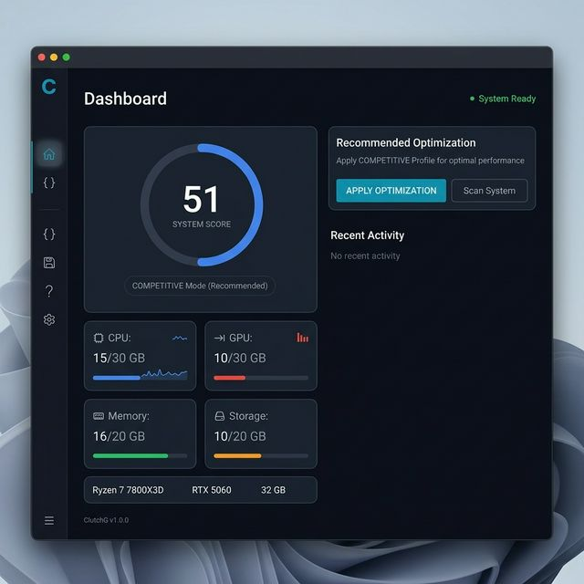
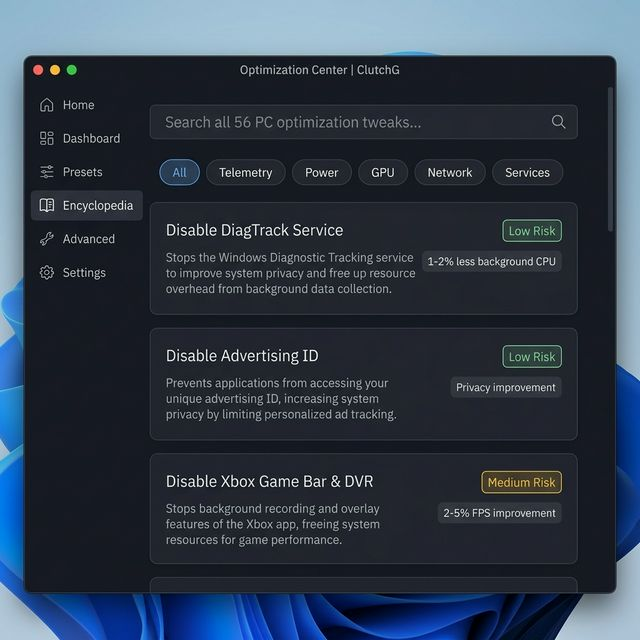
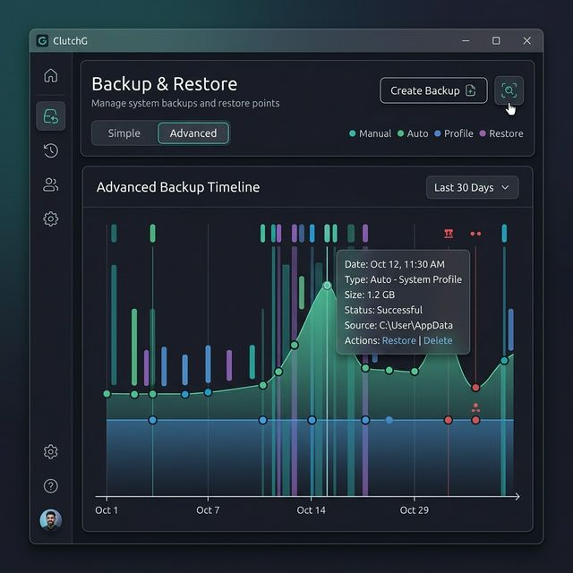
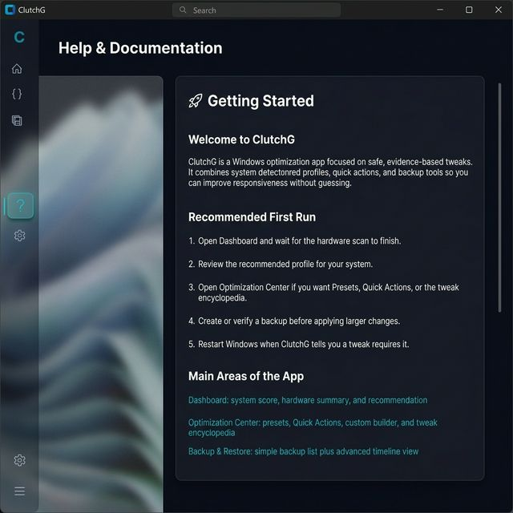

<h1 align="center">
  <br>
  
  <br>
  ClutchG PC Optimizer
  <br>
</h1>

<p align="center">
  <strong>ซอฟต์แวร์ปรับแต่ง Windows จากงานวิจัยจริง ไม่ใช่ความเชื่อ</strong>
</p>

<p align="center">
  <a href="#จุดเด่น">จุดเด่น</a> &middot;
  <a href="#ภาพหน้าจอ">ภาพหน้าจอ</a> &middot;
  <a href="#เริ่มต้นใช้งาน">เริ่มต้นใช้งาน</a> &middot;
  <a href="#โปรไฟล์">โปรไฟล์</a> &middot;
  <a href="#งานวิจัย">งานวิจัย</a> &middot;
  <a href="README.md">English</a>
</p>

<p align="center">
  
  
  
  
  
</p>

---

## ClutchG คืออะไร?

ClutchG เป็นเครื่องมือปรับแต่ง Windows ที่สร้างจากการวิจัยเปรียบเทียบ **เครื่องมือปรับแต่ง 28 ตัว** บน GitHub (โค้ดรวมกว่า 50,000 บรรทัด) จำแนก **48 เทคนิค** ออกเป็น 10 หมวด พร้อมจัดระดับความเสี่ยง เพื่อแยกเทคนิคที่ได้ผลจริงออกจากเทคนิคหลอก

ผลลัพธ์คือ batch optimizer แบบ modular พร้อม GUI สมัยใหม่ ที่ปรับแต่งเฉพาะเทคนิคที่มีหลักฐานรองรับ -- ปลอดภัย โปร่งใส และย้อนกลับได้ทุกขั้นตอน

### หลักการออกแบบ

| | หลักการ | รายละเอียด |
|---|---------|-----------|
| **หลักฐาน** | ทุกเทคนิคมีเอกสารทางเทคนิครองรับ | ไม่มีเทคนิค "เชื่อเถอะ" |
| **ปลอดภัย** | ไม่ปิด Defender, UAC, DEP หรือ Windows Update | ไม่ยอมแลกความปลอดภัย |
| **ย้อนกลับ** | backup อัตโนมัติก่อนทุกการเปลี่ยนแปลง rollback ทีละรายการได้ | ย้อนกลับได้ทุกอย่าง ทุกเมื่อ |
| **โปร่งใส** | ทุก action ถูกบันทึกลง flight recorder | ตรวจสอบย้อนหลังได้เสมอ |
| **ซื่อตรง** | ผลลัพธ์จริง 5-15% ไม่ใช่ 200% | ไม่โฆษณาเกินจริง |

---

## จุดเด่น

- **3 โปรไฟล์** -- SAFE, COMPETITIVE, EXTREME จัดเทคนิคตามระดับความเสี่ยง
- **48 เทคนิคที่ผ่านการคัดกรอง** ครอบคลุม power, GPU, services, network, storage, BCDEdit
- **ตรวจจับฮาร์ดแวร์อัตโนมัติ** -- ระบุ CPU, GPU, RAM แล้วแนะนำโปรไฟล์ที่เหมาะสม
- **Flight Recorder** -- บันทึกทุกการเปลี่ยนแปลงพร้อมค่าก่อน/หลัง
- **Restore Center** -- ดู timeline การเปลี่ยนแปลงทั้งหมด ย้อนกลับทีละรายการได้
- **รองรับสองภาษา** -- ไทยและอังกฤษทั่วทั้งแอป
- **ธีมมืดสมัยใหม่** -- สไตล์ Windows 11 / Sun Valley

---

## ภาพหน้าจอ

<p align="center">
  
  <br><em>หน้า Dashboard แสดงข้อมูลฮาร์ดแวร์และแนะนำโปรไฟล์</em>
</p>

<p align="center">
  
  <br><em>สารานุกรมเทคนิค แสดงระดับความเสี่ยง หมวดหมู่ และคำอธิบายละเอียด</em>
</p>

<p align="center">
  
  <br><em>ศูนย์ย้อนกลับ แสดง timeline พร้อมย้อนกลับทีละรายการได้</em>
</p>

<p align="center">
  
  <br><em>ระบบช่วยเหลือในตัว รองรับทั้งไทยและอังกฤษ</em>
</p>

---

## เริ่มต้นใช้งาน

### วิธี A: ใช้ GUI (แนะนำ)

```powershell
# Clone repository
git clone https://github.com/neckttiie090520/clutchg-pc-optimizer.git
cd clutchg-pc-optimizer

# สร้าง virtual environment
python -m venv venv
venv\Scripts\activate

# ติดตั้ง dependencies
pip install -r clutchg\requirements.txt

# เปิด ClutchG
python clutchg\src\main.py
```

### วิธี B: ใช้ Batch Scripts โดยตรง

```batch
:: เปิด Command Prompt ในโหมด Administrator
cd src
optimizer.bat
```

### สร้างไฟล์ .exe

```powershell
cd clutchg
python build.py
# ผลลัพธ์: clutchg\dist\ClutchG.exe
```

---

## โปรไฟล์

| | โปรไฟล์ | ความเสี่ยง | เหมาะกับ | ผลลัพธ์ที่คาดหวัง |
|---|---------|-----------|---------|-----------------|
| | **SAFE** | ต่ำมาก | ทุกคน | FPS เพิ่ม 2-5% |
| | **COMPETITIVE** | ต่ำ | เกมเมอร์ | FPS เพิ่ม 5-10% |
| | **EXTREME** | ปานกลาง | ผู้เชี่ยวชาญเท่านั้น | FPS เพิ่ม 10-15% |

### SAFE

ปรับ power plan, เปิด HAGS, เปิด Storage Sense, ปิดเฉพาะ telemetry services ไม่มีอะไรที่ทำให้ฟีเจอร์พัง

### COMPETITIVE

เพิ่มการปรับ network stack (Nagle's Algorithm, TCP optimization), จัดการ Xbox/telemetry services, ปรับ GPU power management ยังมี safety whitelist ป้องกันการปิด service สำคัญ

### EXTREME

จัดการ service เชิงรุก, ปรับ BCDEdit boot configuration, ปรับ network stack เต็มรูปแบบ ฟีเจอร์บางอย่างของ Windows อาจหยุดทำงาน ต้องเข้าใจผลกระทบก่อนใช้

---

## โครงสร้างโปรเจกต์

```
clutchg-pc-optimizer/
├── src/                              # Batch Optimizer Engine
│   ├── optimizer.bat                 # จุดเริ่มต้น (v2.0, ต้องมีสิทธิ์ admin)
│   ├── core/                         # โมดูลปรับแต่ง 17 ตัว
│   ├── profiles/                     # SAFE / COMPETITIVE / EXTREME
│   ├── safety/                       # ตรวจสอบ, ย้อนกลับ, flight recorder
│   ├── backup/                       # สำรอง registry, restore point
│   └── logging/                      # บันทึก log
│
├── clutchg/                          # แอปพลิเคชัน GUI (Python)
│   ├── src/
│   │   ├── main.py                   # จุดเริ่มต้น
│   │   ├── core/                     # business logic (13 โมดูล)
│   │   ├── gui/views/               # หน้าจอ 8 หน้า
│   │   ├── gui/components/          # คอมโพเนนต์ 12 ตัว
│   │   └── gui/theme.py             # ระบบธีมมืด
│   ├── tests/                        # ชุดทดสอบ 445 tests
│   └── build.py                      # สร้างไฟล์ .exe
│
├── docs/                             # เอกสารวิจัยและเทคนิค
│   ├── 01-research-overview.md       # วิธีวิจัย
│   ├── 02-repo-analysis/             # วิเคราะห์เครื่องมือ 28 ตัว
│   ├── 03-tweak-taxonomy.md          # จัดหมวดเทคนิคทั้งหมด
│   ├── 04-risk-classification.md     # จัดระดับความเสี่ยง
│   ├── 05-windows-internals.md       # เจาะลึก Windows internals
│   ├── 06-performance-impact.md      # ผลลัพธ์จริง
│   └── iso29110-clutchg/             # เอกสาร ISO 29110
│
└── .github/workflows/ci.yml         # CI pipeline
```

---

## งานวิจัย

โปรเจกต์นี้เริ่มจากการวิจัย วิเคราะห์เครื่องมือปรับแต่ง Windows 28 ตัว เพื่อสร้างความเข้าใจที่อิงหลักฐานว่าอะไรได้ผลจริง

### เทคนิคที่ได้ผลจริง

| เทคนิค | ผลกระทบ | หลักฐาน |
|--------|---------|---------|
| ปรับค่า GPU driver | FPS เพิ่ม 2-15% | เอกสาร vendor ขึ้นอยู่กับเกม |
| ปรับ Power plan | เพิ่ม 2-5% | จัดการ P-state/C-state |
| BCDEdit tweaks ที่ปลอดภัย | เพิ่ม 1-4% | เกมที่ไวต่อ latency |
| ลด background apps | เพิ่ม 1-3% | ลด CPU/RAM contention |

### ความเชื่อที่ไม่จริง

| ความเชื่อ | ความจริง |
|-----------|---------|
| "Windows สำรอง bandwidth 20% สำหรับ QoS" | จำกัดเฉพาะ traffic ที่ tag ไว้ ไม่กระทบเกม |
| "Timer resolution service เพิ่ม FPS" | ล้าสมัย Windows 10 2004 จัดการแบบ per-process แล้ว |
| "ปิด service 100 ตัว = เร็วขึ้น" | ฟีเจอร์พัง ได้ performance น้อยมาก |
| "แก้ registry เกี่ยวกับ network ลด ping" | ปัจจัยหลักคือ ISP และ routing ไม่ใช่ registry |

### สิ่งที่ ClutchG ไม่ทำเด็ดขาด

เทคนิคเหล่านี้ **ไม่อยู่ใน** โปรไฟล์ใด เพราะลดความปลอดภัยโดยไม่คุ้มค่า:

- ปิด Windows Defender
- ปิด DEP / ASLR / CFG
- ปิด Driver Signature Enforcement
- ปิด Windows Update ถาวร
- ปิด UAC

เอกสารวิจัยฉบับเต็มอยู่ใน [`docs/`](docs/)

---

## การทดสอบ

```powershell
cd clutchg

# ติดตั้ง test dependencies
pip install -r requirements-test.txt

# รันทั้งหมด
pytest

# เฉพาะ unit tests
pytest tests\unit -m unit

# เฉพาะ integration tests
pytest tests\integration -m integration

# พร้อม coverage
pytest --cov=src tests/
```

**สถานะปัจจุบัน:** 445 passed, 64 skipped (E2E tests ข้ามเมื่อไม่มี display)

CI รัน unit และ integration tests อัตโนมัติบน `windows-latest` ผ่าน GitHub Actions

---

## ความต้องการของระบบ

- **OS:** Windows 10 22H2 ขึ้นไป หรือ Windows 11
- **Python:** 3.11+ (สำหรับ GUI)
- **สิทธิ์ Administrator** สำหรับการปรับแต่ง
- **Dependencies:** customtkinter, Pillow, psutil, pywin32, py-cpuinfo, wmi

---

## เอกสาร

| เอกสาร | คำอธิบาย |
|--------|---------|
| [Research Overview](docs/01-research-overview.md) | วิธีวิจัยและขอบเขต |
| [Repo Analysis](docs/02-repo-analysis/) | วิเคราะห์เครื่องมือ 28 ตัว |
| [Tweak Taxonomy](docs/03-tweak-taxonomy.md) | ระบบจัดหมวดเทคนิค |
| [Risk Classification](docs/04-risk-classification.md) | เมทริกซ์ประเมินความเสี่ยง |
| [Windows Internals](docs/05-windows-internals.md) | เจาะลึกเทคนิค |
| [Performance Impact](docs/06-performance-impact.md) | ผลลัพธ์จริง |
| [Best Practices](docs/07-best-practices.md) | แนวทางที่แนะนำ |
| [ISO 29110 Work Products](docs/iso29110-clutchg/) | เอกสารวงจรชีวิตซอฟต์แวร์ |

---

## ข้อจำกัดความรับผิดชอบ

ซอฟต์แวร์นี้แก้ไขค่าระบบ Windows แม้ผ่านการวิจัยและทดสอบแล้ว ผลลัพธ์อาจต่างกันตามฮาร์ดแวร์และการตั้งค่าของแต่ละเครื่อง ผู้ใช้ควร:

1. สำรองข้อมูลก่อนทุกครั้ง
2. เริ่มจากโปรไฟล์ SAFE
3. วัดผลก่อนและหลัง
4. อ่านคำอธิบายของแต่ละเทคนิคก่อนเปิดใช้

---

## สัญญาอนุญาต

[MIT](LICENSE)
