# ClutchG PC Optimizer — Thesis Diagrams

All UML and supplementary diagrams for the ClutchG independent study thesis.
Drawn in [draw.io](https://app.diagrams.net/), exported as PNG at 2x scale with 20px border.

---

## Diagram Index

| # | Diagram | Type | Thesis Section |
|---|---------|------|----------------|
| 01 | [System Architecture Overview](#01-system-architecture-overview) | Architecture | Ch.3 System Design |
| 02 | [Batch Optimizer Execution Flow](#02-batch-optimizer-execution-flow) | Flowchart | Ch.3 System Design |
| 03 | [GUI Navigation Flow](#03-gui-navigation-flow) | Flowchart | Ch.3 System Design |
| 04 | [Tweak Lifecycle](#04-tweak-lifecycle) | Activity | Ch.3 System Design |
| 05 | [Risk Classification Framework](#05-risk-classification-framework) | Custom / Entity | Ch.2 Literature Review |
| 06 | [Module Dependency Map](#06-module-dependency-map) | Component | Ch.3 System Design |
| 07 | [Use Case Diagram](#07-use-case-diagram) | UML Use Case | Ch.3 Requirements |
| 08 | [Class Diagram (Full)](#08-class-diagram-full) | UML Class | Appendix |
| 08a | [Class Diagram (Simplified)](#08a-class-diagram-simplified) | UML Class | Ch.3 System Design |
| 08b | [Class Diagram — Data Models](#08b-class-diagram-data-models) | UML Class | Appendix |
| 09 | [Sequence Diagram](#09-sequence-diagram) | UML Sequence | Ch.3 System Design |
| 10 | [Deployment Diagram](#10-deployment-diagram) | UML Deployment | Ch.3 System Design |
| 11 | [Conceptual Framework](#11-conceptual-framework) | Custom | Ch.1 Introduction |
| 12 | [Project Timeline (Gantt Chart)](#12-project-timeline-gantt-chart) | Gantt | Ch.1 / Project Plan |
| 13 | [Tweak State Diagram](#13-tweak-state-diagram) | UML State | Ch.3 System Design |

---

## 01 — System Architecture Overview

**File:** `01-system-architecture-overview.drawio`

High-level view of the entire ClutchG system showing the three main layers:
- **ClutchG GUI** (Python/CustomTkinter) — the user-facing desktop application
- **Batch Optimizer Engine** (`src/`) — modular `.bat` scripts organized by function
- **Windows OS** — the target system being optimized

Shows how the GUI discovers and invokes batch scripts, how scripts interact with Windows subsystems (Registry, Services, Power, Network, etc.), and where safety mechanisms (backup, rollback, flight recorder) sit in the pipeline.

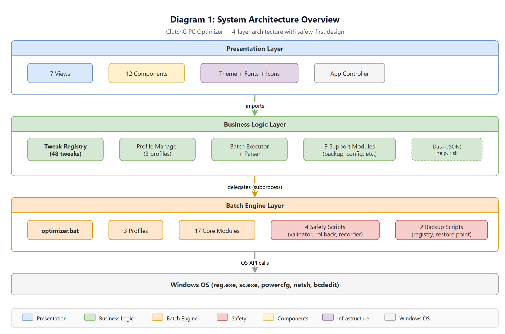

---

## 02 — Batch Optimizer Execution Flow

**File:** `02-batch-optimizer-execution-flow.drawio`

Step-by-step flowchart of what happens when a user runs an optimization profile through the batch engine:
1. Admin rights check
2. System detection (OS version, hardware)
3. Backup creation (registry + restore point)
4. Profile loading (SAFE / COMPETITIVE / EXTREME)
5. Module execution with validation
6. Flight recorder logging
7. Result summary

Covers error paths and rollback triggers.


---

## 03 — GUI Navigation Flow

**File:** `03-gui-navigation-flow.drawio`

Shows how users navigate through the ClutchG desktop application. Maps the sidebar navigation to each view:
- Dashboard (system info, quick actions)
- Scripts (browse/run batch modules)
- Profiles (SAFE/COMPETITIVE/EXTREME selection)
- Backup & Restore
- Help
- Settings

Includes view transitions, dialog popups, and the Welcome screen first-run flow.

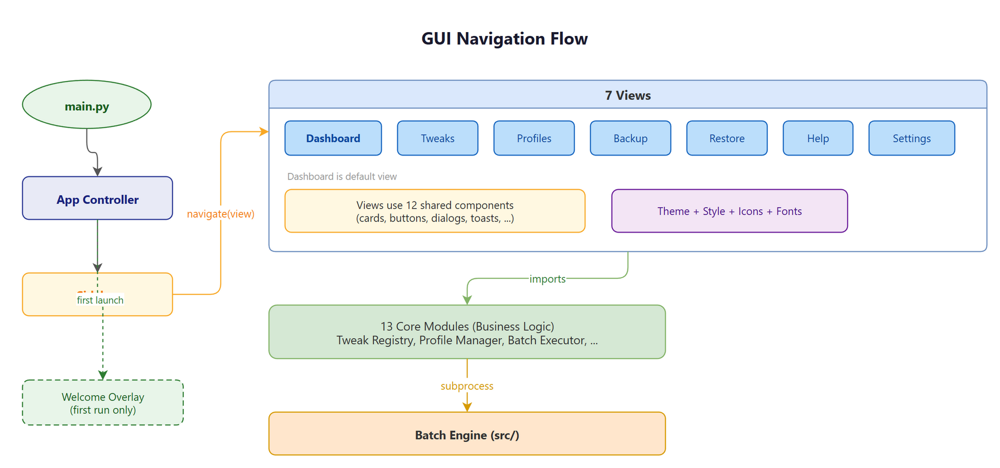

---

## 04 — Tweak Lifecycle

**File:** `04-tweak-lifecycle.drawio`

Activity diagram tracing a single tweak from research to deployment:
1. Research & evidence gathering
2. Risk classification (LOW/MEDIUM/HIGH)
3. Registration in TweakRegistry
4. Profile assignment
5. Batch script implementation
6. GUI discovery via BatchParser
7. User applies tweak
8. Logging & rollback availability

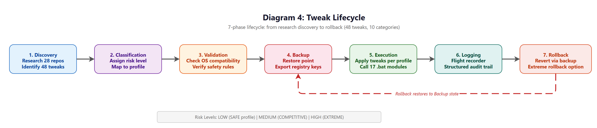

---

## 05 — Risk Classification Framework

**File:** `05-risk-classification-framework.drawio`

Visualizes the three-tier risk model used to classify all 48 tweaks:
- **LOW** risk — safe for all users, minimal system impact
- **MEDIUM** risk — gaming-focused, may affect non-gaming workflows
- **HIGH** risk — aggressive changes, potential stability trade-offs

Shows classification criteria (reversibility, scope of change, failure impact) and how risk levels map to profiles (SAFE = LOW only, COMPETITIVE = LOW+MEDIUM, EXTREME = all).

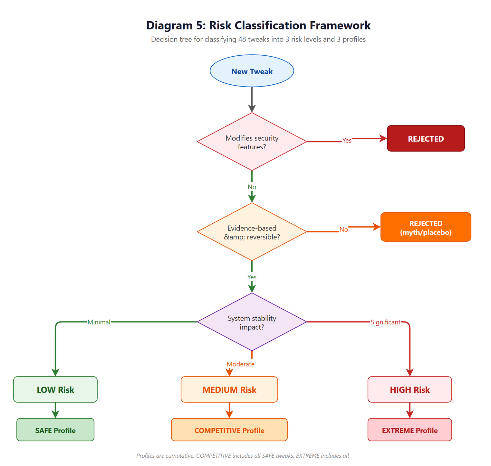

---

## 06 — Module Dependency Map

**File:** `06-module-dependency-map.drawio`

Component diagram showing how batch modules in `src/core/` depend on each other and on shared infrastructure (`logger.bat`, `flight-recorder.bat`, `validator.bat`). Groups modules by category:
- Power & Performance
- Services & Telemetry
- Network & Input
- Storage & Maintenance
- GPU & Display

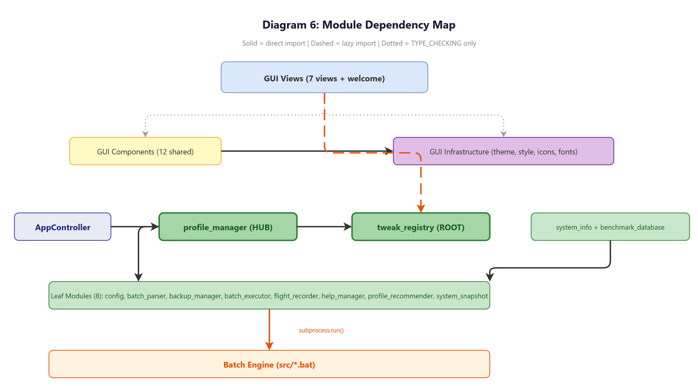

---

## 07 — Use Case Diagram

**File:** `07-use-case-diagram.drawio`

UML Use Case diagram with two actors:
- **User** — views system info, selects profiles, applies tweaks, creates backups, restores settings
- **System (Windows OS)** — executes registry changes, manages services, creates restore points

Use cases cover the full workflow: view dashboard, browse tweaks, apply profile, backup/restore, view help, change settings. Includes `<<include>>` and `<<extend>>` relationships.

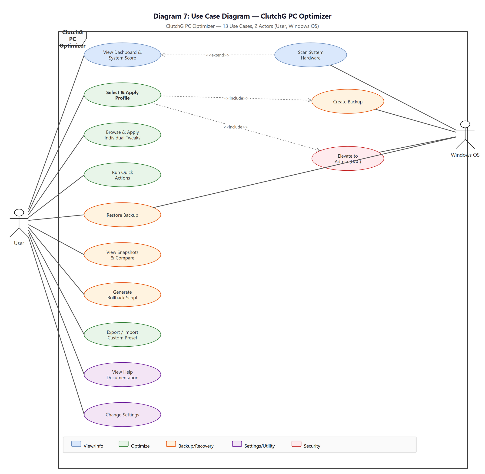

---

## 08 — Class Diagram (Full)

**File:** `08-class-diagram.drawio`

Complete UML class diagram showing all classes in `clutchg/src/` with attributes, methods, and relationships. Contains all core, GUI, and utility classes. Best viewed at full zoom or printed on A3.

> This is the reference version for the appendix. For the thesis body, use 08a (simplified) below.

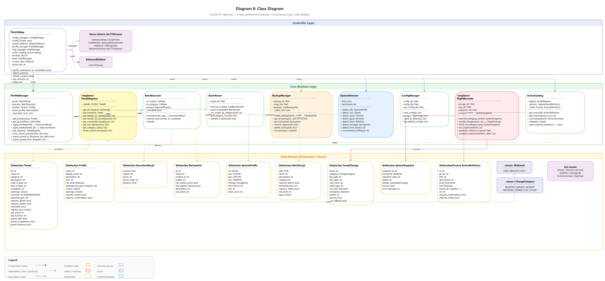

---

## 08a — Class Diagram (Simplified)

**File:** `08a-class-diagram-simplified.drawio`

Simplified class diagram for the thesis body chapter. Shows the key architectural classes grouped into:
- **App Layer** — `ClutchGApp` (main controller)
- **Core Business Logic** — `ProfileManager`, `TweakRegistry`, `BatchExecutor`, `BatchParser`, `BackupManager`, `SystemDetector`, `ActionCatalog`, `FlightRecorder`, `ConfigManager`

Relationships: composition ("owns"), usage ("uses"), dependency arrows. Omits GUI view classes and data model details (those are in 08b).

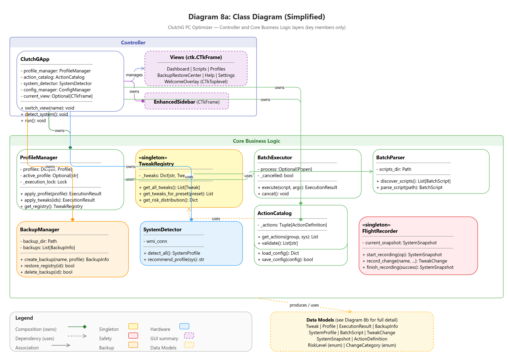

---

## 08b — Class Diagram — Data Models

**File:** `08b-class-diagram-datamodels.drawio`

UML class diagram focusing on data structures and enums:
- `Tweak` dataclass (id, name, category, risk_level, expected_gain, etc.)
- `RiskLevel` enum (LOW, MEDIUM, HIGH)
- `TweakCategory` enum (10 categories)
- `ProfileType` enum (SAFE, COMPETITIVE, EXTREME)
- `BackupEntry`, `SystemInfo`, `ActionResult` dataclasses

Shows field types, enum values, and relationships between data models.


---

## 09 — Sequence Diagram

**File:** `09-sequence-diagram.drawio`

UML sequence diagram showing the message flow when a user applies an optimization profile:

`User` -> `ClutchGApp` -> `ProfileManager` -> `BackupManager` -> `BatchExecutor` -> `Windows OS`

Covers: profile selection, backup creation, tweak iteration, batch script execution, result collection, flight recorder logging, and UI feedback.

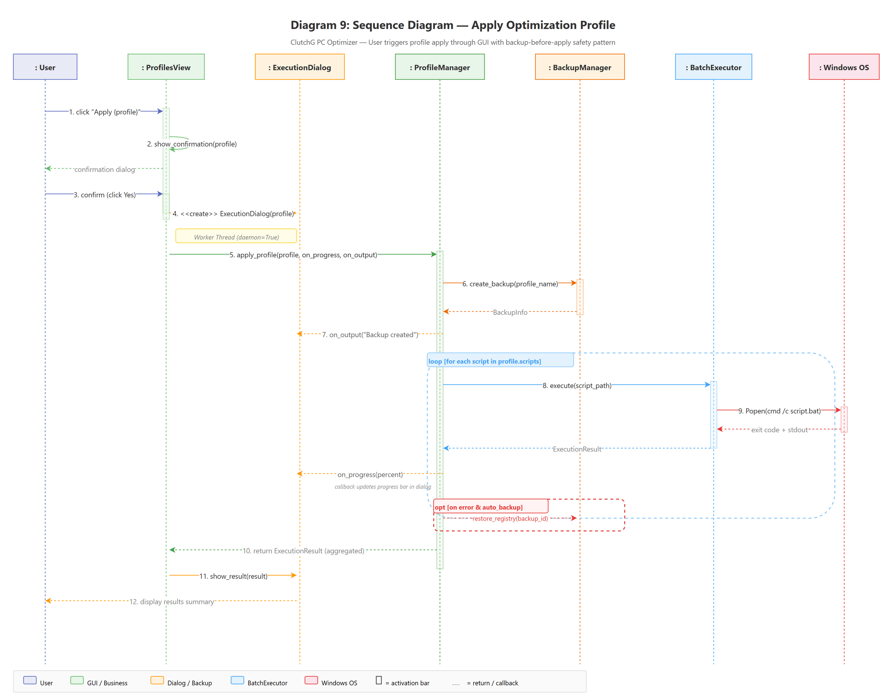

---

## 10 — Deployment Diagram

**File:** `10-deployment-diagram.drawio`

UML deployment diagram showing the physical runtime environment:
- **User's PC** node containing:
  - `ClutchG.exe` (Python/CustomTkinter, packaged via PyInstaller)
  - Batch scripts (`src/`)
  - Windows subsystems (Registry, Services, PowerCfg, etc.)
- Artifacts: `.bat` files, `.json` configs, log files, registry backups

Shows `<<artifact>>` and `<<execute>>` stereotypes.


---

## 11 — Conceptual Framework

**File:** `11-conceptual-framework.drawio`

High-level research framework connecting:
- **Input:** 28 open-source optimizer repos analyzed, 50,000+ lines reviewed
- **Process:** Tweak classification, risk framework, evidence-based filtering
- **Output:** ClutchG tool (batch engine + GUI), thesis documentation

Shows the relationship between research methodology, the tool's design decisions, and the expected outcomes (5-15% performance improvement, safety-first approach).

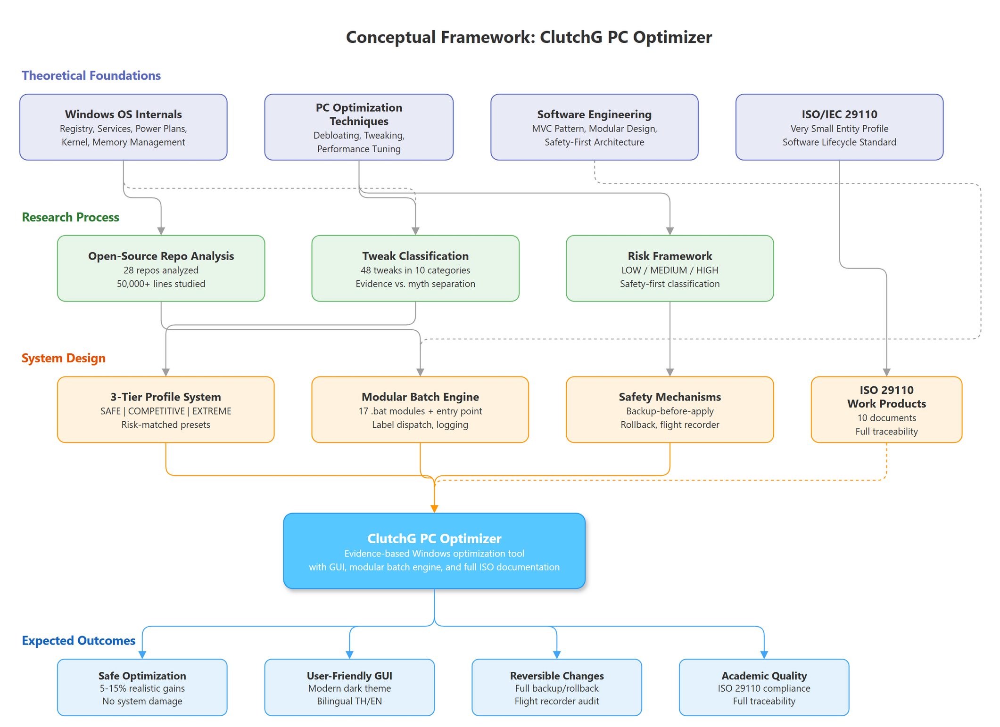

---

## 12 — Project Timeline (Gantt Chart)

**File:** `12-gantt-chart.drawio`

Gantt chart showing the project schedule across phases:
- Literature review & repo analysis
- System design & architecture
- Batch engine implementation
- GUI development
- Testing & quality assurance
- Thesis writing & documentation
- ISO 29110 work products

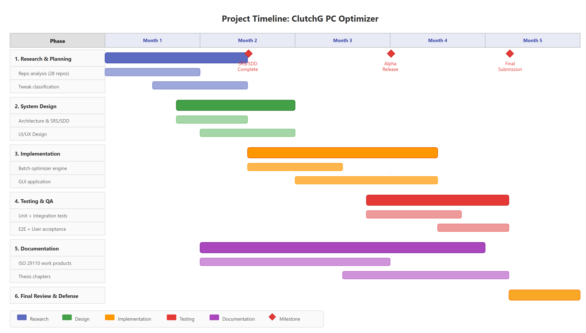

---

## 13 — Tweak State Diagram

**File:** `13-state-diagram.drawio`

UML state diagram for a tweak's runtime lifecycle:
- **Registered** — tweak exists in TweakRegistry
- **Selected** — user chose it (via profile or manual)
- **Validating** — safety checks running
- **Applying** — batch script executing
- **Applied** — change active on system
- **Failed** — error during application
- **Rolled Back** — user or system reverted the change

Shows transitions, guards, and error recovery paths.

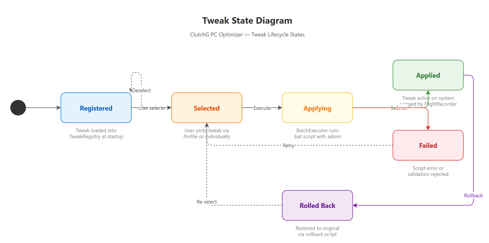

---

## Design Conventions

All diagrams follow these rules:

| Rule | Value |
|------|-------|
| Font | Segoe UI |
| Title size | 16pt bold |
| Color coding | Blue = View/Info, Green = Optimize/Business, Orange = Backup/Safety, Red = Security, Yellow = Components, Purple = Settings/Infrastructure |
| Export | PNG, scale 2x, 20px border |
| Source format | `.drawio` (editable in draw.io desktop or web) |
| Legend | Included in each diagram where color coding is used |

## How to Edit

1. Open any `.drawio` file in [draw.io](https://app.diagrams.net/) (web) or the desktop app
2. Edit as needed
3. Export: `File > Export as > PNG` with scale 2x and 20px border
4. Or via CLI:
   ```
   "C:\Program Files\draw.io\draw.io.exe" --export --format png --scale 2 --border 20 --output <name>.png <name>.drawio
   ```
