# Appendix A — แผนภาพ UML (UML Diagrams)

> **โครงงาน:** ClutchG PC Optimizer v2.0
> **วันที่:** 2026-03-04
> **อ้างอิง:** UML 2.5.1, SRS v3.0, SDD v3.0

---

## 1. User Diagram (Context Diagram)

แสดงผู้มีส่วนเกี่ยวข้องกับระบบ ClutchG ทั้งหมด

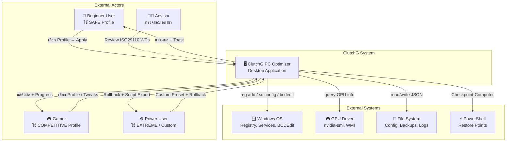

---

## 2. Use Case Diagram

แสดง Use Cases ทั้งหมดจัดกลุ่มตามฟังก์ชัน

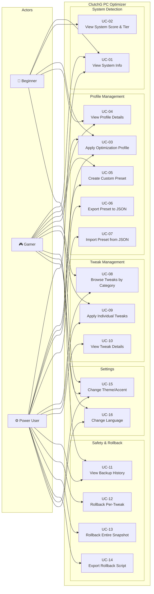

---

## 3. Use Case Descriptions

### UC-01: View System Info

| รายการ | รายละเอียด |
|--------|-----------|
| **Use Case ID** | UC-01 |
| **ชื่อ** | View System Info |
| **Actor** | Beginner, Gamer, Power User |
| **คำอธิบาย** | ผู้ใช้เปิดโปรแกรมแล้วดูข้อมูล Hardware ของเครื่อง (CPU, GPU, RAM, Storage) พร้อมคะแนนและ tier |
| **Trigger** | เปิดโปรแกรม (auto-detect) หรือกดปุ่ม Refresh |
| **Precondition** | โปรแกรมเปิดอยู่ |
| **Main Flow** | 1. ระบบเริ่ม system detection (background thread) 2. ตรวจจับ CPU (cpuinfo → psutil → WMI fallback) 3. ตรวจจับ GPU (nvidia-smi → WMI fallback) 4. ตรวจจับ RAM (psutil) 5. ตรวจจับ Storage (psutil) 6. คำนวณ score: CPU(0-30) + GPU(0-30) + RAM(0-20) + Storage(0-10) = 0-100 7. จำแนก tier: entry/mid/high/enthusiast 8. แสดงผลบน Dashboard พร้อม icon + score bar |
| **Postcondition** | Dashboard แสดง CPU, GPU, RAM, Storage, Score, Tier |
| **Alternative** | 2a. cpuinfo ไม่พร้อม → ใช้ WMI 3a. nvidia-smi ไม่มี → ใช้ WMI (Win32_VideoController) |
| **Exception** | 2b. ตรวจจับล้มเหลวทั้งหมด → แสดง "Unknown" + score = 0 |
| **NFR** | NFR-08 (async threading ไม่ block UI) |
| **Source** | `core/system_info.py` L100-380, `app_minimal.py` L117-145 |

---

### UC-03: Apply Optimization Profile

| รายการ | รายละเอียด |
|--------|-----------|
| **Use Case ID** | UC-03 |
| **ชื่อ** | Apply Optimization Profile |
| **Actor** | Beginner (SAFE), Gamer (COMPETITIVE), Power User (EXTREME) |
| **คำอธิบาย** | ผู้ใช้เลือก optimization profile แล้ว apply ให้ระบบทำ tweaks ทั้งหมดใน profile |
| **Trigger** | กดปุ่ม "Apply" บนหน้า Profiles |
| **Precondition** | 1. สิทธิ์ Administrator 2. System detection เสร็จแล้ว 3. Batch scripts มีครบ (verify_scripts=True) |
| **Main Flow** | 1. ผู้ใช้เข้าหน้า Profiles → เห็น 3 cards (SAFE 🟢 / COMPETITIVE 🟡 / EXTREME 🔴) 2. ผู้ใช้เลือก profile → อ่าน risk level, expected FPS, warnings 3. ผู้ใช้กด "Apply" 4. **ระบบสร้าง backup** (BackupManager.create_backup):    - Export 6 registry keys เป็น .reg    - สร้าง Windows Restore Point (PowerShell → WMIC fallback) 5. **FlightRecorder เริ่ม recording** (start_recording)    - Capture registry snapshot (reg export → _before.reg) 6. **Apply tweaks ทีละตัว** (for each tweak in profile):    - แสดง progress bar (on_progress callback)    - Execute .bat script + function (subprocess)    - บันทึก TweakChange: {name, key_path, old_value, new_value, rollback_command}    - แสดง per-tweak status ✅/❌ (on_tweak_status callback) 7. **FlightRecorder จบ recording** (finish_recording)    - Capture registry snapshot (reg export → _after.reg)    - Save JSON (change_logs/{id}.json) 8. แสดง Toast notification "Profile applied successfully!" |
| **Postcondition** | 1. Tweaks ถูก apply 2. Backup + Restore Point พร้อม 3. FlightRecord JSON บันทึกครบ (rollback ready) |
| **Alternative** | 3a. ผู้ใช้กด Cancel → กลับหน้า Profiles ไม่มีอะไรเปลี่ยน 6a. Tweak บางตัว fail → บันทึก error, ทำตัวต่อไป |
| **Exception** | 4a. Backup creation fail → แจ้ง warning, proceed (ไม่ block) 5a. Restore Point fail → ลอง WMIC fallback → log warning 6b. Script file ไม่มี → skip tweak + error log |
| **Business Rules** | - SAFE: 17 tweaks (LOW risk เท่านั้น) - COMPETITIVE: 35 tweaks (LOW + MEDIUM) - EXTREME: 48 tweaks ทั้งหมด (รวม HIGH 3 ตัว) |
| **NFR** | NFR-03 (reversible), NFR-04 (auto backup), NFR-09 (realistic FPS claim) |
| **Source** | `core/profile_manager.py` L146-257, `core/backup_manager.py` L73-140, `core/flight_recorder.py` L160-334 |

---

### UC-05: Create Custom Preset

| รายการ | รายละเอียด |
|--------|-----------|
| **Use Case ID** | UC-05 |
| **ชื่อ** | Create Custom Preset |
| **Actor** | Gamer, Power User |
| **คำอธิบาย** | ผู้ใช้เลือก tweaks ทีละตัวจาก 48 tweaks แล้ว save เป็น custom preset |
| **Trigger** | เปิดหน้า Scripts → เลือก tweaks → กด Save Preset |
| **Precondition** | หน้า Scripts เปิดอยู่ |
| **Main Flow** | 1. ผู้ใช้เข้าหน้า Scripts → เห็น 10 categories 2. เลือก tweaks (checkbox) → ดู risk badge + warnings 3. กด "Save as Preset" → ใส่ชื่อ preset 4. ระบบ validate: build_custom_preset(ids) → {tweaks, max_risk, requires_restart, warnings} 5. Save preset ใน config.json 6. แสดง Toast "Preset saved!" |
| **Postcondition** | Preset บันทึกใน config + พร้อมใช้จากหน้า Profiles |
| **Extension** | UC-06: Export ไป JSON file UC-07: Import จาก JSON file |
| **Source** | `core/tweak_registry.py` L975-1001, `core/profile_manager.py` L421-527 |

---

### UC-12: Rollback Per-Tweak

| รายการ | รายละเอียด |
|--------|-----------|
| **Use Case ID** | UC-12 |
| **ชื่อ** | Rollback Per-Tweak |
| **Actor** | Power User |
| **คำอธิบาย** | ผู้ใช้ undo ทีละ tweak จาก Backup Center โดยเลือก tweak ที่ต้องการ revert |
| **Trigger** | กดปุ่ม "Undo" ข้าง tweak ในหน้า Backup & Restore Center |
| **Precondition** | มี snapshot อย่างน้อย 1 รายการ (FlightRecorder) |
| **Main Flow** | 1. ผู้ใช้เข้าหน้า Backup Center → เห็น timeline ของ snapshots 2. เลือก snapshot → เห็นรายการ TweakChange (before/after values) 3. กด "Undo" ข้าง tweak ที่ต้องการ 4. ระบบ execute rollback_command:    `reg add "HKLM\...\key" /v ValueName /t REG_DWORD /d old_value /f` 5. อัพเดต UI (สถานะ tweak → "Reverted") 6. แสดง Toast "Tweak reverted" |
| **Postcondition** | Registry value กลับเป็นค่าเดิม (old_value) |
| **Alternative** | UC-13: Rollback ทั้ง snapshot (reversed order) |
| **Exception** | 4a. reg add fail (Access Denied) → แจ้ง error 4b. Registry key ถูกเปลี่ยนโดย process อื่น → แจ้ง warning |
| **Source** | `core/flight_recorder.py` L521-540, `gui/views/backup_restore_center.py` |

---

### UC-08: Browse Tweaks by Category

| รายการ | รายละเอียด |
|--------|-----------|
| **Use Case ID** | UC-08 |
| **ชื่อ** | Browse Tweaks by Category |
| **Actor** | Gamer, Power User |
| **คำอธิบาย** | ผู้ใช้เรียกดู tweaks ทั้ง 48 ตัว จัดกลุ่มตาม 10 categories |
| **Trigger** | คลิก sidebar "Scripts" |
| **Precondition** | ไม่มี |
| **Main Flow** | 1. ระบบแสดง 10 categories: Telemetry(8), Input(6), Power(7), GPU(8), Network(6), Services(5), Memory(4), Boot(5), Visual(4), Cleanup(3) 2. แต่ละ category มี icon + color + count 3. ผู้ใช้ expand category → เห็น tweaks ในกลุ่ม 4. แต่ละ tweak แสดง: name, risk badge (🟢🟡🔴), checkbox, "?" help button 5. กด "?" → popup: what_it_does, why_it_helps, limitations, warnings, expected_gain |
| **Postcondition** | ผู้ใช้เข้าใจ tweak ก่อนเลือก |
| **Source** | `core/tweak_registry.py` L39-51, L884-933, `gui/views/scripts_minimal.py` |

---

### UC-15: Change Theme/Accent

| รายการ | รายละเอียด |
|--------|-----------|
| **Use Case ID** | UC-15 |
| **ชื่อ** | Change Theme and Accent Color |
| **Actor** | ทุก Actor |
| **คำอธิบาย** | ผู้ใช้เปลี่ยน theme (dark/light) และ accent color (5 สี) |
| **Trigger** | เข้าหน้า Settings |
| **Main Flow** | 1. เข้า Settings → เห็น Theme toggle (Dark/Light) + Accent picker (Cyan, Purple, Green, Orange, Pink) 2. เลือก theme หรือ accent → ระบบ refresh UI ทันที (hot-swap) 3. บันทึกใน config.json |
| **Postcondition** | UI เปลี่ยนสี + persist ข้าม session |
| **Source** | `gui/views/settings_minimal.py`, `app_minimal.py` L260-280 |

---

## 4. Activity Diagrams

### 4.1 Activity Diagram: Apply Profile Workflow

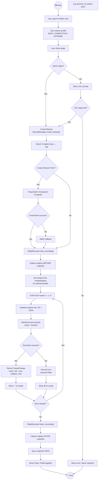

### 4.2 Activity Diagram: Rollback Workflow

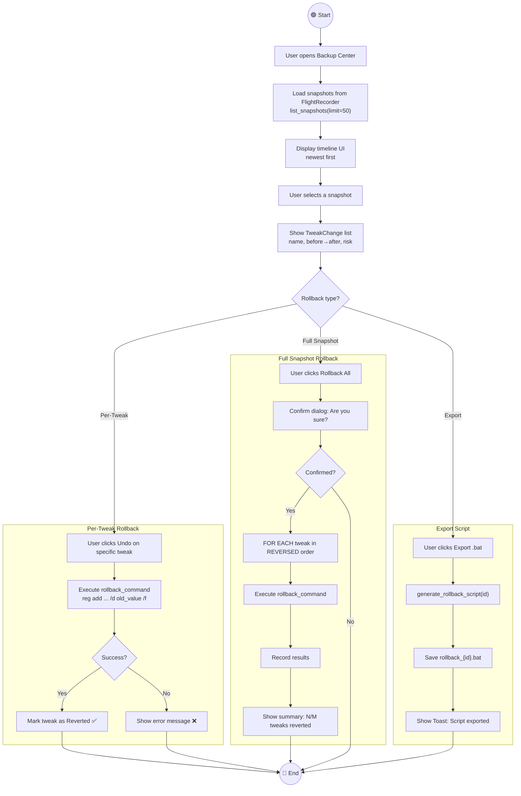

### 4.3 Activity Diagram: System Detection

```mermaid
flowchart TD
    START(("🟢 Start"))
    A1["App launches → Start background thread"]
    
    subgraph "CPU Detection"
        C1["Try cpuinfo library"]
        DC1{"cpuinfo available?"}
        C2["Get brand_raw, frequency"]
        C3["Try WMI: Win32_Processor"]
        DC2{"WMI available?"}
        C4["CPU name from WMI"]
        C5["CPU = Unknown"]
        C6["Detect vendor: Intel / AMD / Apple"]
        C7["BenchmarkDB.get_cpu_score()<br/>→ score 0-30"]
    end
    
    subgraph "GPU Detection"
        G1["Try nvidia-smi query"]
        DG1{"nvidia-smi success?"}
        G2["Parse name + VRAM"]
        G3["Try WMI: Win32_VideoController"]
        DG2{"WMI found discrete GPU?"}
        G4["Get GPU name + VRAM from WMI"]
        G5["GPU = Unknown"]
        G6["Detect vendor: NVIDIA / AMD / Intel"]
        G7["BenchmarkDB.get_gpu_score()<br/>→ score 0-30"]
    end
    
    subgraph "RAM & Storage"
        M1["psutil.virtual_memory()<br/>→ total_gb (rounded up)"]
        M2["RAM score = min(20, total_gb / 2)"]
        S1["psutil.disk_partitions()<br/>→ C: drive usage"]
        S2["Storage score: SSD/NVMe=10, HDD=5"]
    end
    
    subgraph "Score Calculation"
        SC1["total = cpu.score + gpu.score<br/>+ ram.score + storage.score"]
        SC2{"total ≥ 70?"}
        SC3["Tier = enthusiast"]
        SC4{"total ≥ 50?"}
        SC5["Tier = high"]
        SC6{"total ≥ 30?"}
        SC7["Tier = mid"]
        SC8["Tier = entry"]
    end
    
    R1["Build SystemProfile"]
    R2["Callback: _on_detection_complete()"]
    R3["Refresh Dashboard UI"]
    END(("🔴 End"))
    
    START --> A1 --> C1 --> DC1
    DC1 -->|"Yes"| C2 --> C6
    DC1 -->|"No"| C3 --> DC2
    DC2 -->|"Yes"| C4 --> C6
    DC2 -->|"No"| C5 --> C6
    C6 --> C7 --> G1
    
    G1 --> DG1
    DG1 -->|"Yes"| G2 --> G6
    DG1 -->|"No"| G3 --> DG2
    DG2 -->|"Yes"| G4 --> G6
    DG2 -->|"No"| G5 --> G6
    G6 --> G7 --> M1 --> M2 --> S1 --> S2
    
    S2 --> SC1 --> SC2
    SC2 -->|"Yes"| SC3 --> R1
    SC2 -->|"No"| SC4
    SC4 -->|"Yes"| SC5 --> R1
    SC4 -->|"No"| SC6
    SC6 -->|"Yes"| SC7 --> R1
    SC6 -->|"No"| SC8 --> R1
    
    R1 --> R2 --> R3 --> END
```

---

## 5. System Diagram (Component Architecture)

```mermaid
graph TB
    subgraph "Presentation Layer"
        APP["ClutchGApp<br/>app_minimal.py<br/>(Main Controller)"]
        SB["EnhancedSidebar"]
        VT["ViewTransition"]
        
        subgraph "Views"
            V1["DashboardView<br/>25.8KB"]
            V2["ProfilesView<br/>10.7KB"]
            V3["ScriptsView<br/>63.5KB"]
            V4["BackupRestoreCenter<br/>35.7KB"]
            V5["HelpView<br/>23.3KB"]
            V6["SettingsView<br/>12KB"]
            V7["WelcomeOverlay<br/>12.7KB"]
        end
        
        subgraph "Components"
            W1["RiskBadge"]
            W2["Toast"]
            W3["ExecutionDialog"]
            W4["ContextHelpButton"]
        end
    end
    
    subgraph "Business Logic Layer"
        subgraph "Core Managers"
            PM["ProfileManager<br/>528 lines"]
            TR["TweakRegistry<br/>1013 lines<br/>48 tweaks"]
            SD["SystemDetector<br/>381 lines"]
            BM["BackupManager<br/>373 lines"]
            FR["FlightRecorder<br/>589 lines"]
            BP["BatchParser<br/>450 lines"]
            BE["BatchExecutor<br/>200 lines"]
            CM["ConfigManager<br/>120 lines"]
            HM["HelpManager<br/>100 lines"]
            BD["BenchmarkDB<br/>450 lines"]
            AC["ActionCatalog"]
            PR["ProfileRecommender"]
            SS["SystemSnapshot"]
        end
    end
    
    subgraph "Infrastructure Layer"
        subgraph "Batch Scripts"
            BS1["telemetry-blocker.bat"]
            BS2["input-optimizer.bat"]
            BS3["power-manager.bat"]
            BS4["gpu-optimizer.bat"]
            BS5["network-optimizer.bat"]
            BS6["service-manager.bat"]
            BS7["bcdedit-manager.bat"]
            BS8["debloater.bat"]
            BS9["storage-optimizer.bat"]
        end
        
        subgraph "Data Storage"
            JSON1["config/config.json"]
            JSON2["data/backups/backup_index.json"]
            JSON3["data/flight_recorder/change_logs/*.json"]
            REG["data/flight_recorder/registry_snapshots/*.reg"]
        end
        
        subgraph "Windows OS"
            WREG["Windows Registry<br/>HKLM / HKCU"]
            WSVC["Windows Services<br/>sc.exe"]
            WBCD["BCDEdit<br/>bcdedit.exe"]
            WPS["PowerShell<br/>Checkpoint-Computer"]
        end
    end
    
    APP --> SB
    APP --> VT
    APP --> V1 & V2 & V3 & V4 & V5 & V6
    
    V1 --> SD
    V2 --> PM
    V3 --> TR
    V4 --> FR & BM
    V5 --> HM
    V6 --> CM
    
    PM --> TR
    PM --> BM
    PM --> FR
    PM --> BP
    PM --> BE
    
    SD --> BD
    SD --> PR
    
    TR --> AC
    
    BE --> BS1 & BS2 & BS3 & BS4 & BS5 & BS6 & BS7 & BS8 & BS9
    
    BM --> JSON2
    FR --> JSON3 & REG
    CM --> JSON1
    
    BS1 & BS2 & BS3 & BS4 & BS5 & BS6 --> WREG
    BS6 --> WSVC
    BS7 --> WBCD
    BM --> WPS
```

---

## 6. Sequence Diagrams

### 6.1 Sequence Diagram: Apply Optimization Profile (Full Detail)

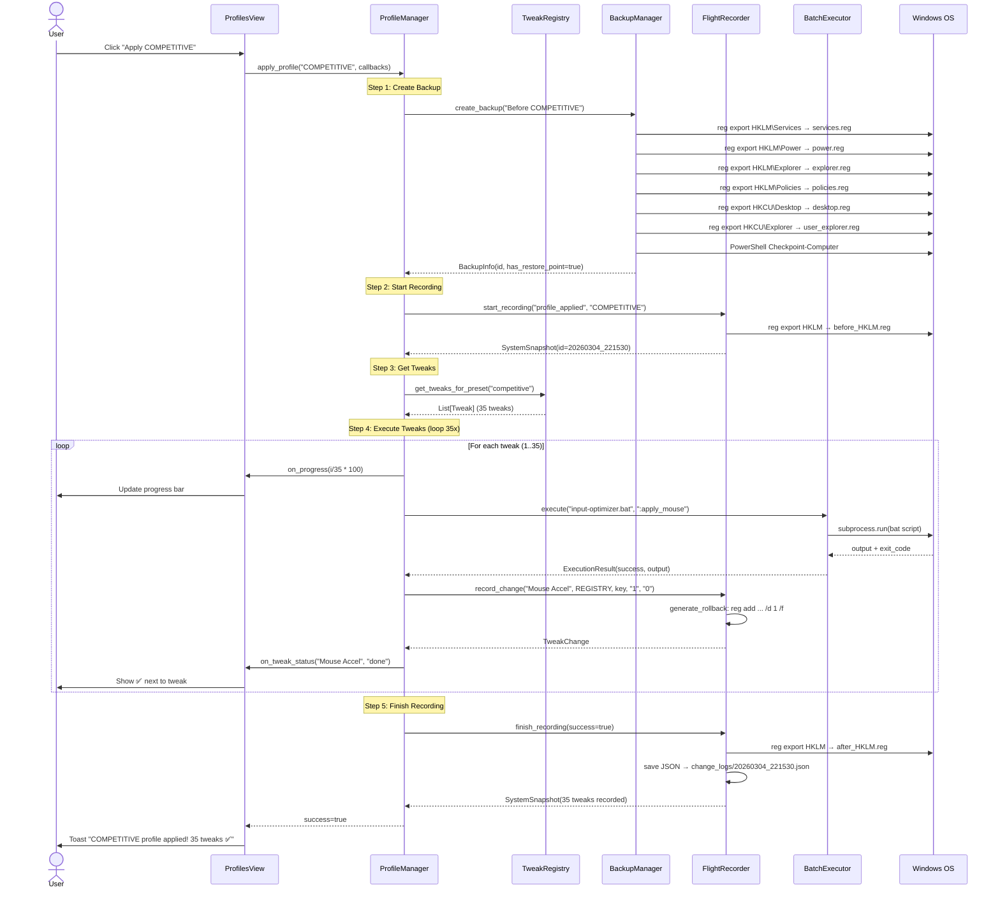

### 6.2 Sequence Diagram: Per-Tweak Rollback

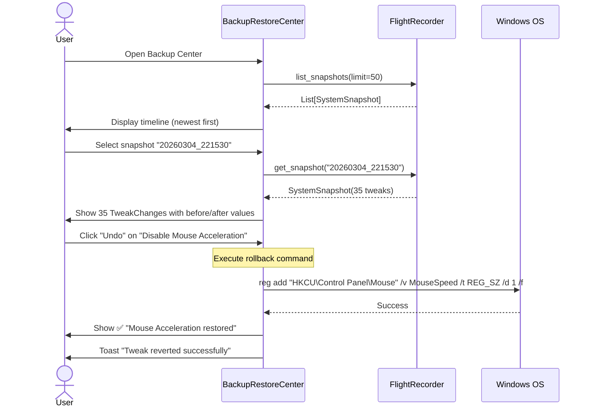

### 6.3 Sequence Diagram: System Detection

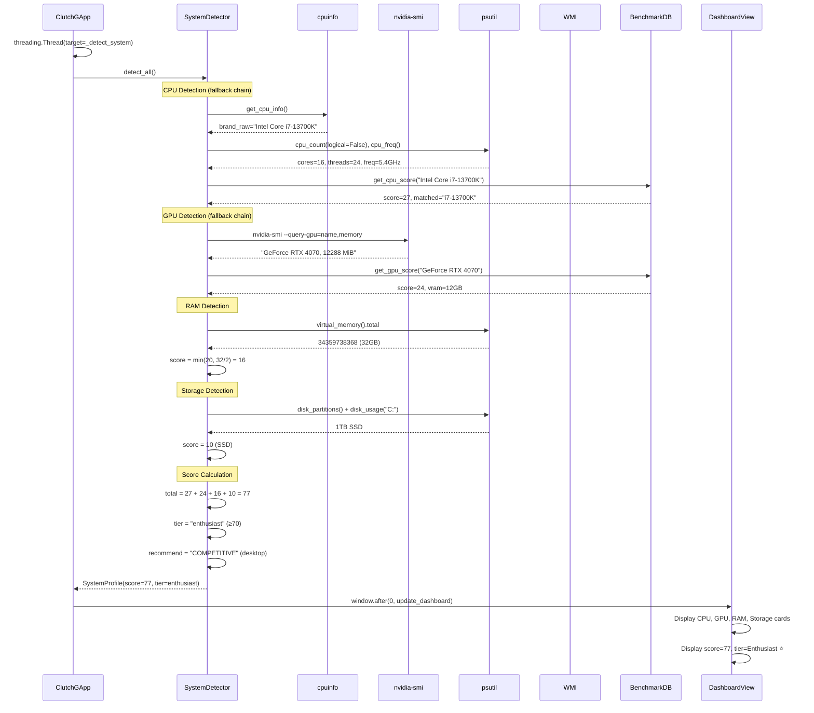

### 6.4 Sequence Diagram: Export/Import Custom Preset

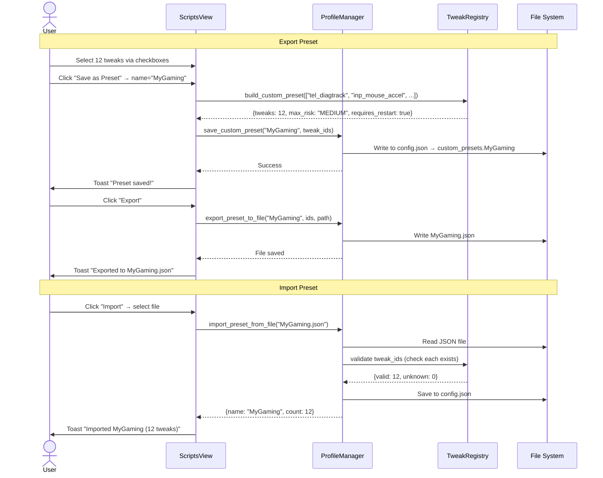

---

## 7. Class Diagram (Core Domain)

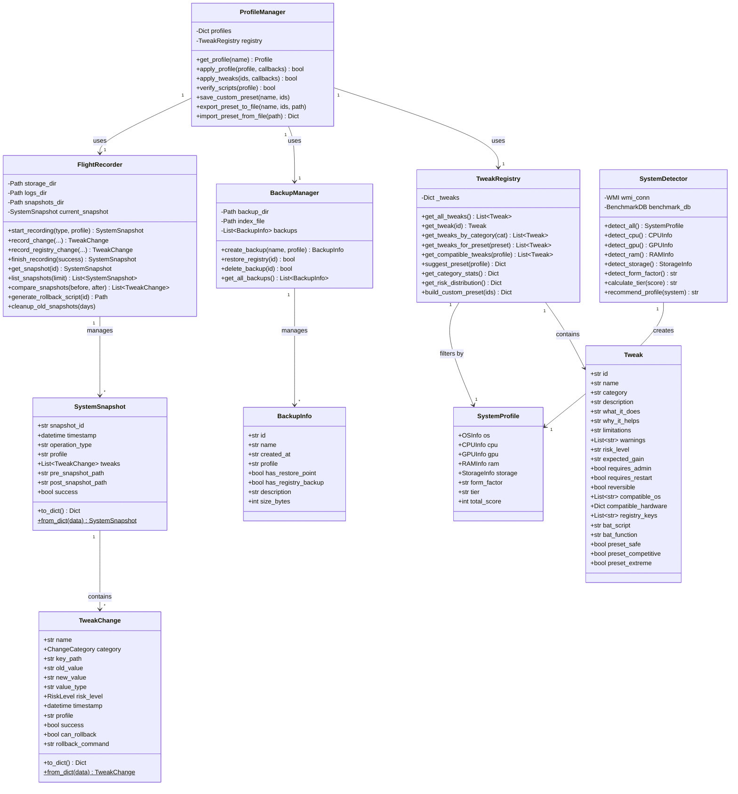

---

**จบ Appendix A — UML Diagrams**
